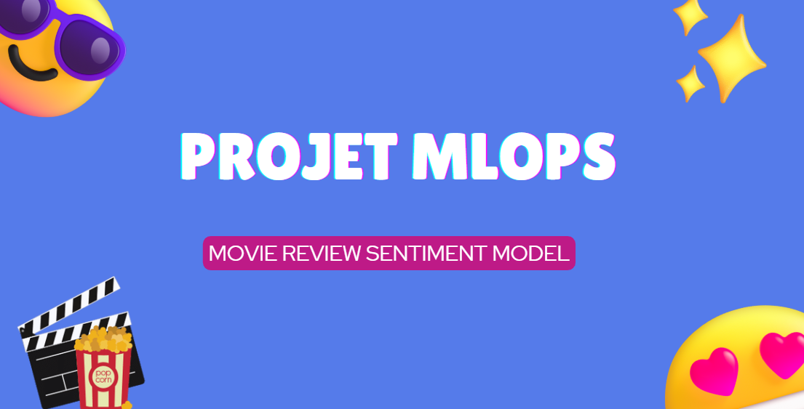
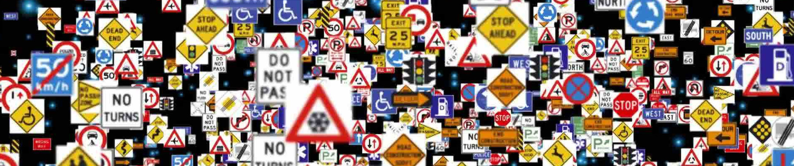

<h1 align="center">Portfolio</h1>

Welcome to my portfolio! Here, you will find a selection of my projects completed as part of my studies, as well as my personal experiments in web development and data analytics.
Each project showcases my skills in these two areas, demonstrating my versatility and passion for coding and data analysis.

<h2 align="center">📈 My Data Projects</h2>

 
### 🔹 **Project : SmartReader Chat – Résumeur d'articles scientifiques 📚💬**

👉 [View the project here](https://github.com/Liily77/lydianeghad.github.io/tree/smartreader-app)

**Description :**  
SmartReader est une application web basée sur **Streamlit** permettant d'interagir avec des articles scientifiques au format PDF. Elle repose sur une architecture RAG (Retrieval-Augmented Generation) pour résumer et extraire les points clés à partir du texte scientifique, avec des réponses générées par l’IA.

**Main Objectives** :

- **Extraction** : Téléversement et découpage intelligent du contenu PDF en *chunks*  
- **Embedding** : Génération rapide de vecteurs avec **MiniLM**  
- **Recherche** : Passage pertinent retrouvé avec **FAISS**  
- **Résumé** : Généré à l’aide des modèles **Ollama** (Mistral, Phi, TinyLlama…)  
- **Interaction** : Interface de chat avec historique exportable en .txt  
- **Performance** : Optimisation du traitement pour garantir fluidité et rapidité

🛠️ **Technologies :** Streamlit, Python, LangChain, FAISS, ChromaDB, MiniLM (sentence-transformers), Ollama, Git

 

  

 

### 🔹 **Project : MLOps – Sentiment Analysis of Oscar-Nominated Films (2020–2024) 🎬🤖**  

👉 [View the project here](https://github.com/PierrePssi/Projet_MLOPS)

**Description** : This project applies machine learning and MLOps best practices to classify movie reviews (positive, negative, neutral) for Oscar-nominated films from 2020 to 2024. It simulates a production-ready deployment with full tracking, containerization, CI/CD, and cloud hosting.

**Main Objectives** :

- **Preprocessing** : Text cleaning, stopwords removal, lemmatization using NLTK  
- **Vectorization** : Transformation of reviews with TF-IDF  
- **Modeling** : Logistic regression with Scikit-learn  
- **Tracking** : Logging models and metrics with MLflow  
- **Automation** : CI/CD pipeline using GitHub Actions  
- **Containerization** : Dockerizing the Streamlit app for portability  
- **Deployment** : Hosting the app with AWS ECS and pushing images to ECR  

🛠️ **Technologies :** Python, Scikit-learn, MLflow, Docker, GitHub Actions, NLTK, AWS (ECS & ECR), Git
 
 

  

 

### **🔹 Project : Power BI & Azure – Analysis of the Company Meublatex 🛋️📊**

👉 [View the project here](https://github.com/Liily77/lydianeghad.github.io/tree/Projet_PowerBI_Azure)

**Description:**
This project combines **Power BI** and **Azure Data Factory** to build a comprehensive decision-making system around the data of the fictional company **Meublatex**. The goal was to centralize, transform, and analyze the data to aid in strategic decision-making.

**Main Objectives:**

- **Storage** : Centralization of data in an **Azure Data Lake**
- **ETL** : Creation of pipelines with **Azure Data Factory** (ODS & DWH)
- **Modeling** : Implementation of a structured **Data Warehouse**
- **Visualization** : Interactive multi-page **Power BI dashboard**
- **Analysis** : DAX calculations for **revenue**, **margin**, **profits**, **key products**, and **customers**

**🛠️ Technologies :** Azure Data Factory, Azure Data Lake, Power BI, SQL, DAX, Git
 
 

  

 

### **🔹 Project : Traffic Sign Classification with CNN 🚦🧠**

👉 [View the project here](https://github.com/Liily77/lydianeghad.github.io/tree/Projet_Deep_Learning)

**Description:**
This project aims to automatically classify **traffic signs** from the **GTSRB dataset** using **Convolutional Neural Networks (CNN)**. The goal is to simulate a key task for autonomous driving systems.

**Main Objectives:**

- **Preprocessing :** resizing, normalization, image augmentation
- **Modeling :** implementation of **simple and advanced CNN models**
- **Optimization :** regularization, fine-tuning, EarlyStopping, LR Scheduler
- **Evaluation :** accuracy, F1 score, confusion matrix
- **Experimentation :** **Transfer Learning with EfficientNetB0**, Grad-CAM for interpretation

**🛠️ Technologies:** Python, TensorFlow, Keras, CNN, EfficientNet, Grad-CAM

  

 

### **🔹 Project : 🧠 Neo4j - Stored Procedures for Graph-Based Neural Networks 🚀**

👉 [View the project here](https://github.com/Liily77/lydianeghad.github.io/tree/Projet_Neo4J)

**Description:**
This project builds upon an academic repository that we enriched by adding **Java stored procedures** for **Neo4j**, with the goal of modeling and training a neural network directly within a graph-oriented database. Cypher queries were encapsulated in compiled Java classes for better modularity and performance.

**Main Objectives:**

- Transform Cypher scripts into **Java stored procedures**.
- **Create and configure** a neural network (layers, neurons, inputs/outputs).
- **Load input data** and **expected output** into Neo4j.
- Implement **forward pass**, **backpropagation with Adam**, and **loss computation**.
- Manage **results and constraints on weights** through specialized classes.

**Class Structure:**
- `CreateNetwork.class`, `CreateNeuron.class`, `SetInputs.class`, etc.
- `ForwardPass.class`, `BackwardPassAdam.class`, `ComputeLoss.class`, etc.
- Each `.class` file has its `*Result.class` version for execution return.

**🛠️ Technologies:** Neo4j, Java, Cypher, Python, Git, IntelliJ, Maven/Gradle

 
 

  

 

### **🔹 Project : Data Processing and Analysis Pipeline with Spark and Scala 🚀**

👉 [View the project here](https://github.com/Liily77/lydianeghad.github.io/tree/spark-data-pipeline)

**Description:**
This project uses **Scala** and **Apache Spark** to automate a data processing pipeline. The goal was to manipulate, transform, and analyze complex datasets while adhering to a modular structure and best practices in data engineering.
The analyses include data extraction, cleaning, transformation, and aggregation with validation through unit tests.

**Main Objectives:**

- **Extraction:** Reading and ingesting **CSV, JSON, XML** files.
- **Cleaning:** Standardizing formats and handling **missing values**.
- **Transformation:** Creating new columns (**TTC, Contract Status**).
- **Analysis:** Aggregating data and generating **insights**.
- **Validation:** Implementing **unit tests** with **ScalaTest**.

**🛠️ Technologies:** Scala, Apache Spark, Spark SQL, SBT, ScalaTest, Log4j2

 
 

  

### **🔹 Project : Scala and PySpark Analysis on Databricks 🚀**

👉 [View the project here](https://github.com/Liily77/lydianeghad.github.io/tree/Databricks_Scala_Project)

**Description:**
This project was carried out on **Databricks** using **Scala** and **PySpark** to analyze complex data. The goal was to efficiently manipulate, transform, and visualize the data by creating data cubes and performing cross-analyses between students and professors.

**Main Objectives:**

- **Loading and processing** **JSON** data.
- **Creating data cubes** for **multi-dimensional analysis**.
- **Performing cross-analyses** between **students and professors**.
- **Implementing a prioritization system** and **organizing results**.
- **Generating visualizations** and **logically sorting results**.

**🛠️ Technologies :** Scala, PySpark, SQL, JSON, Databricks

 
 

  

### **🔹 Project : Machine Learning - Sentiment Analysis of Oscar-Nominated Films (2020-2024) 🎬**

👉 [View the project here](https://github.com/Liily77/lydianeghad.github.io/tree/projet_machine_learning)

**Description:**
This project applies **Machine Learning** to analyze **reviews** of films nominated or awarded at the **Oscars** between **2020 and 2024**.
The goal is to classify reviews as **positive, negative, or neutral**, while exploring trends and providing actionable insights.

**Objectives:**

- **Collect and clean** reviews from **Allociné, IMDb, Rotten Tomatoes**
- **Feature Engineering** with **TF-IDF, Word2Vec, and pre-trained embeddings**
- **Model Training:** **Logistic Regression, Random Forest, LSTM**
- **Performance Evaluation** with **Accuracy, F1-score**
- **Analyze rating and opinion trends**

**🛠️ Technologies:**

 
 

  

### **🔹 Project : Analysis of Wi-Fi Hotspots in Paris 🌐**

👉 [View the Streamlit application here](https://hotpost-wifi-paris-project.streamlit.app/)

**Description:**
This Python project aims to explore and analyze Wi-Fi hotspot usage data in Paris, highlighting geographical, temporal, and behavioral trends. The Streamlit application offers interactive visualizations to examine connections, devices, languages used, and usage patterns.

👉 [Access the project branch](https://github.com/Liily77/lydianeghad.github.io/tree/Streamlit)

**Main Objectives:**

- **Geographical Analysis :** Distribution of connections **by district** and **interactive mapping**.
- **Temporal Analysis :** Evolution of connections by year, heatmap of connections **by day and hour**.
- **User Analysis :** Distribution of **languages used** and **usage trends**.
- **Interactive WordCloud :** Visual representation of **main concepts** in textual data.
- **Deployment of an interactive application** with **Streamlit** for **data visualization**.

**🛠️ Technologies :** Python, Pandas, Plotly, Streamlit

 
 

  
  

### **🔹 Project : Analysis of Rowers' Performance 🚣‍♂️📊**

👉 [View the notebook here](https://github.com/Liily77/lydianeghad.github.io/blob/Analyse-Donn%C3%A9es-Sportives/analyse-rameurs.ipynb)

**Description :**
This Python project aims to analyze the performance of rowers over a 2000m distance, segmented into 500m portions. Through interactive visualizations and advanced analyses, we explored the factors influencing performance and compared rowers against each other.

👉 [Access the project branch](https://github.com/Liily77/lydianeghad.github.io/tree/Analyse-Donn%C3%A9es-Sportives)

**Main Objectives :**

- **Data Preparation :** Extraction and cleaning of **JSON** data, transformation to obtain **information per rower and per segment**.
- **Exploratory Analysis :** Calculation of **average speeds, cadences, calories consumed per kilometer**.
- **Comparison of Rowers :** Study of **adopted strategies** and **performance differences**.
- **Dynamic Visualization :** Interactive graphs showing **performance evolution** over the race.
- **Advanced Correlations :** Analysis of the impact of **cadence on energy expenditure** and **final speed**.

**🛠️ Technologies :** Python, Pandas, Matplotlib, Seaborn, Plotly, Jupyter

 
 

  

 

<h2 align="center">👩🏻‍💻 My Web Development Projects</h2>

 

<h3>🔹 Project : <strong>Clinique Oscar - Osteopathy Appointment Booking ⚕️</strong></h3>

👉 View the site here: <a href="https://lydianeghad.alwaysdata.net/Clinique_Oscar/"> Clinique Oscar Website</a> 

<strong>Description:</strong> 
A website for booking appointments at an osteopathy clinic.

<a href="https://github.com/Liily77/lydianeghad.github.io/tree/projet_clinique_oscar">Access the project branch</a>

  
  
  
  

 
 

  

 
<h3>🔹 Project : <strong>Driving Experience Tracking Log 🚗</strong></h3>

👉 View the site here: <a href="https://lydianeghad.alwaysdata.net/SPConduite/index.html"> SP Driving</a>

<strong>Description :</strong> 
This project allows users to track their driving experience by recording details such as weather, traffic conditions, and distance driven.

<a href="https://github.com/Liily77/lydianeghad.github.io/tree/projet_SP_conduite">Access the project branch</a>

  
  
  
  
  
  
  

 
 

  

 
<h3>🔹 Project : <strong>HTML/CSS Tutorial Creation 👩🏻‍💻</strong></h3>

👉 View the site here: <a href="https://lydianeghad.alwaysdata.net/duweb24/CSS/TP3/Template.html"> Tutorial Website</a> 

<strong>Description:</strong> 
This project is an interactive tutorial designed to teach the basics of front-end development using HTML and CSS.

<a href="https://github.com/Liily77/lydianeghad.github.io/tree/projet_tutoriel">Access the project branch</a>

  
  

 
 

  

 

